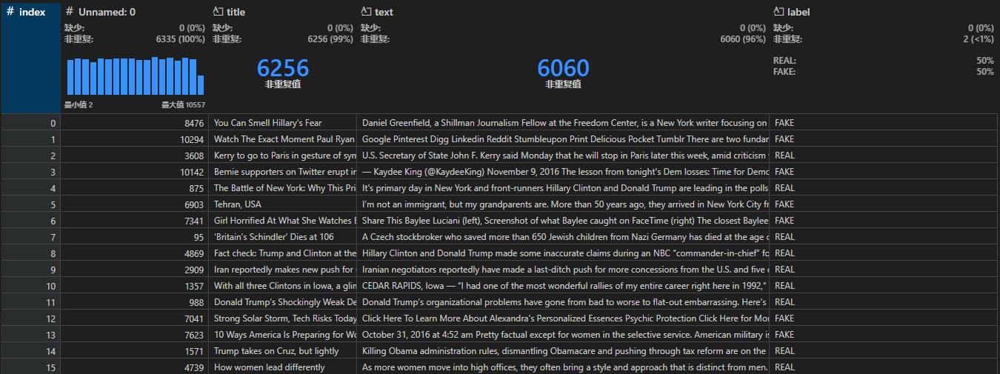
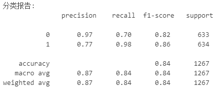
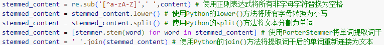
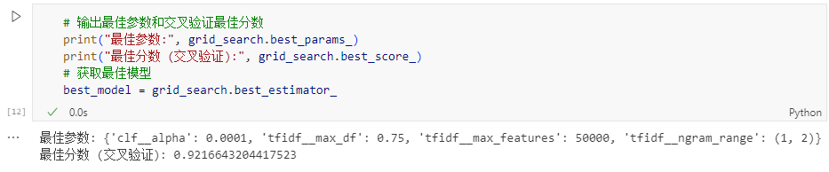
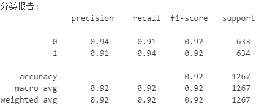

# scikit-learn构建英文新闻真假判断模型
***

## 基本信息
数据集由 `nop.ai` 公司创建，包含 6335 条新闻及其标题，并有真假标签，其中假新闻有 3164 条，真新闻 3171 条，数据详情见 news.csv 文件。

给出的数据集中包含新闻的标题（title）、正文（text）以及真假判断的标签（label）。使用朴素贝叶斯算法，基于给出的数据集构建真假新闻判断模型。朴素贝叶斯算法是一种基于贝叶斯定理的概率分类器。它假设特征之间是相互独立的，这是一个简化的假设，但在实践中通常表现良好。对于假新闻检测，可以使用多项式朴素贝叶斯模型，该模型适用于离散特征，例如词频。

实践使用Python语言中的scikit-learn库创建模型，其提供了**多项式朴素贝叶斯模型（Multinomial Naive Bayes）** 和**TF-IDF向量化器（TfidfVectorizer）** 等多项功能。

文本处理方面，使用**NLTK（Natural Language Toolkit）**提供的**PorterStemmer**，可以减少单词的变体，将其转换为词干形式，例如，"running"、"runs" 和 "ran" 都会被转换为词干 "run"。这样做有助于减少特征空间的维度，并提高模型的泛化能力。此外，还使用**正则表达式**帮助进行文本处理。

为了提高模型准确度，使用了scikit-learn提供的**网格搜索交叉验证方法（GridSearchCV）** 来寻找最佳参数搭配。

## 模型建立过程
在此之前，使用多项式朴素贝叶斯分类直接建立模型的过程位于 `./notebooks/MultinomialNB.ipynb` 中，分类报告如下：

准确率较低，为提高准确率，使用参数网格交叉验证方法优化参数。模型建立过程位于 `./notebooks/GridSearchCV_Best_Model.ipynb` 中：

1. **数据导入与读取**  
   - 通过Pandas读取CSV文件，获得带有标题、正文以及标签的完整数据集。

2. **文本预处理**  
文本预处理能够去除噪音（例如标点、符号），统一文本格式并提取关键词，帮助后续的特征抽取和分类器更精准地识别重要信息。通过分词、大小写转换、去停用词、词干化四个步骤，能减少冗余数据和不必要的干扰，从而提升模型训练的效率与准确度。

   - 将标签“FAKE”映射为0，“REAL”映射为1。   
   - 使用正则表达式去除非字母字符，并将所有字母转换为小写。  
   - 应用PorterStemmer做词干提取，得到清洗过的文本。

3. **建立管道**  
管道将多个步骤（如向量化、特征变换与分类器）整合为一个连续流程，便于管理和调参；同时保证同样的预处理和模型设置可以一致地应用在训练集和测试集上，减少重复代码和手动操作的风险。
   - 在Pipeline中先使用TfidfVectorizer将文本转化为TF-IDF向量，设定停用词为英语、可调节最大特征数和n元语法范围。  
   - 之后使用MultinomialNB分类器，对转换后的向量进行分类。

4. **参数网格与交叉验证**  
参数网格交叉验证会按指定的参数组合（形成“网格”）逐一训练模型，并采用多折交叉验证，将训练集分成多个子集，循环在不同子集上验证模型效果，从而挑选出表现最佳的参数设置。
   - 为TfidfVectorizer和MultinomialNB的主要参数（如max_df、max_features、n-gram范围、alpha等）设置候选值构建参数网格。  
   - 使用GridSearchCV对管道进行多折交叉验证和最优参数搜索，找到最能提升交叉验证得分的超参数组合。

   

5. **模型训练和评估**  
   - 根据最优参数重新训练模型。  
   - 在测试集上进行预测，计算并输出准确率、精确率、召回率、F1分数等指标。

   
   经过优化，准确率得到显著提升。

6. **模型保存**  
   - 通过joblib将训练好的最佳模型序列化为文件，便于后续部署与使用。

## 部署
一个简单实例已通过Streamlit部署于[Streamlit网站](https://news-judgement.streamlit.app/)，可以直接查看。项目也支持自行部署：
* 本地运行案例
    确保已安装streamlit环境，并使用以下命令运行streamlit实例：
    `streamlit run src/streamlit.py`
* Docker部署
    本项目已提供docker镜像用于案例部署：
    `elix1r/news-judgement-demo`

## 技术
[在此查看](/docs/techniques.md)

## 相关文档

[scikit-learn : Naive Bayes](https://scikit-learn.org/1.5/modules/naive_bayes.html#multinomial-naive-bayes)

[scikit-learn : GridSearchCV](https://scikit-learn.org/dev/modules/generated/sklearn.model_selection.GridSearchCV.html)

[scikit-learn : TfidfVectorizer](https://scikit-learn.org/1.5/modules/generated/sklearn.feature_extraction.text.TfidfVectorizer.html)

[scikit-learn : Pipeline](https://scikit-learn.org/1.5/modules/generated/sklearn.pipeline.Pipeline.html)

[Python 正则表达式 | 菜鸟教程](https://www.runoob.com/python/python-reg-expressions.html)

[NLTK : Sample usage for stem](https://www.nltk.org/howto/stem.html)
