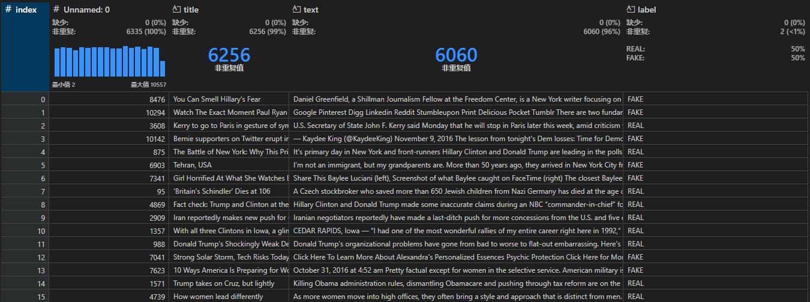

# scikit-learn构建英文新闻真假判断模型

## 基本信息
数据集由 `nop.ai` 公司创建，包含 6335 条新闻及其标题，并有真假标签，其中假新闻有 3164 条，真新闻 3171 条，数据详情见 news.csv 文件。

给出的数据集中包含新闻的标题（title）、正文（text）以及真假判断的标签（label）。使用朴素贝叶斯算法，基于给出的数据集构建真假新闻判断模型。朴素贝叶斯算法是一种基于贝叶斯定理的概率分类器。它假设特征之间是相互独立的，这是一个简化的假设，但在实践中通常表现良好。对于假新闻检测，可以使用多项式朴素贝叶斯模型，该模型适用于离散特征，例如词频。

实践使用Python语言中的scikit-learn库创建模型，其提供了实践所需的**多项式朴素贝叶斯模型（Multinomial Naive Bayes）** 和**TF-IDF向量化器（TfidfVectorizer）** 等多项功能。

文本处理方面，使用**NLTK（Natural Language Toolkit）** 提供的**PorterStemmer**，可以减少单词的变体，将其转换为词干形式，例如，"running"、"runs" 和 "ran" 都会被转换为词干 "run"。这样做有助于减少特征空间的维度，并提高模型的泛化能力。此外，还使用了**正则表达式**帮助进行文本处理。

为了提高模型准确度，使用了scikit-learn提供的**网格搜索交叉验证方法（GridSearchCV）** 来寻找最佳参数搭配。

## 部署
* 查看demo：
一个简单实例已通过Streamlit部署于[Streamlit网站](https://news-judgement.streamlit.app/)
* 本地运行：
确保已安装streamlit环境
`streamlit run src/streamlit_app.py`
## [技术](/docs/techniques.md)

## 相关文档与教程

[scikit-learn : Naive Bayes](https://scikit-learn.org/1.5/modules/naive_bayes.html#multinomial-naive-bayes)

[scikit-learn : GridSearchCV](https://scikit-learn.org/dev/modules/generated/sklearn.model_selection.GridSearchCV.html)

[scikit-learn : TfidfVectorizer](https://scikit-learn.org/1.5/modules/generated/sklearn.feature_extraction.text.TfidfVectorizer.html)

[scikit-learn : Pipeline](https://scikit-learn.org/1.5/modules/generated/sklearn.pipeline.Pipeline.html)

[Python 正则表达式 | 菜鸟教程](https://www.runoob.com/python/python-reg-expressions.html)

[NLTK : Sample usage for stem](https://www.nltk.org/howto/stem.html)
