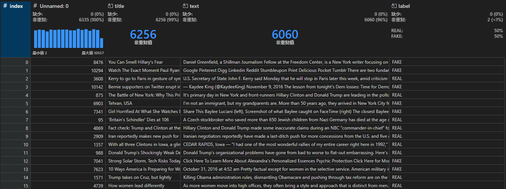

# 实践：真假新闻判断模型

[Python 正则表达式 | 菜鸟教程](https://www.runoob.com/python/python-reg-expressions.html)

[NLTK :: Sample usage for stem](https://www.nltk.org/howto/stem.html)

[1.9. Naive Bayes](https://scikit-learn.org/1.5/modules/naive_bayes.html#multinomial-naive-bayes)

[TfidfVectorizer](https://scikit-learn.org/1.5/modules/generated/sklearn.feature_extraction.text.TfidfVectorizer.html)

# 思路



给出的数据集中包含新闻的标题（title）、正文（text）以及真假判断的标签（label）。实践使用朴素贝叶斯算法，基于给出的数据集构建真假新闻判断模型。朴素贝叶斯算法是一种基于贝叶斯定理的概率分类器。它假设特征之间是相互独立的，这是一个简化的假设，但在实践中通常表现良好。对于假新闻检测，可以使用多项式朴素贝叶斯模型，该模型适用于离散特征，例如词频。

实践使用Python语言中的scikit-learn库创建模型，其提供了实践所需的**多项式朴素贝叶斯模型（Multinomial Naive Bayes）**和**TF-IDF向量化器（TfidfVectorizer）**等多项功能。

文本处理方面，使用NLTK库（Natural Language Toolkit）。NLTK提供了PorterStemmer，可以减少单词的变体，将其转换为词干形式，例如，"running"、"runs" 和 "ran" 都会被转换为词干 "run"。这样做有助于减少特征空间的维度，并提高模型的泛化能力。

此外，实践还是用了正则表达式帮助进行文本处理。

# 关键技术介绍

## TF-IDF向量化器

TF-IDF向量化器 是一种将文本数据转换为数值向量表示的常用技术，在自然语言处理中有着广泛的应用。它通过计算词语在文档中的词频（Term Frequency）和逆文档频率（Inverse Document Frequency）来衡量词语的重要性，并将其转化为数值特征，从而使计算机能够更好地理解和处理文本数据。

- 词频（TF）： 一个词语在一个文档中出现的次数。词频越高，通常认为该词语在该文档中越重要。
- 逆文档频率（IDF）： 一个词语在整个语料库中出现的文档数的倒数的对数。IDF值越高，说明该词语在整个语料库中越少见，越具有区分度。
- TF-IDF： TF和IDF的乘积，综合考虑了词语在文档中的局部重要性和在整个语料库中的全局重要性。
工作原理：
- 分词： 将文本分割成单个词语。
- 构建词典： 将所有文档中的词语构建成一个词典。
- 计算TF-IDF： 对于每个文档中的每个词语，计算其TF-IDF值。
- 构建向量： 将每个文档的TF-IDF值组成一个向量，即该文档的向量表示。

优点：

- 简单易懂： 概念清晰，计算简单。
- 效果较好： 在很多文本分类、聚类等任务中表现良好。
- 可解释性强： TF-IDF值可以直观地反映词语的重要性。

缺点：

- 无法捕捉语义： 只考虑词频和文档频率，无法理解词语之间的语义关系。
- 对停用词敏感： 停用词（如“的”、“是”等）的TF-IDF值可能很高，需要进行预处理。

应用场景：

- 文本分类： 将文本分为不同的类别，如情感分类、新闻分类等。
- 文本聚类： 将相似的文本文档聚在一起。
- 信息检索： 在搜索引擎中对搜索结果进行排序。
- 关键词提取： 提取文本中的关键词。

TF-IDF 向量化器有几个重要的参数可以调整：

- **`ngram_range`:** 指定要考虑的 n-gram 范围。例如，`(1, 1)` 表示只考虑 unigrams (单个词)，`(1, 2)` 表示考虑 unigrams 和 bigrams (两个词的组合)，`(1, 3)` 表示考虑 unigrams、bigrams 和 trigrams (三个词的组合)。
- **`max_df`:** 忽略文档频率高于给定阈值的词。这可以帮助去除一些常见的、不具有区分性的词。
- **`min_df`:** 忽略文档频率低于给定阈值的词。这可以帮助去除一些非常罕见的、可能不重要的词。
- **`max_features`:** 指定要保留的最大特征数量。这可以帮助减少特征空间的维度。

## 多项式朴素贝叶斯分类器（MultinomialNB）

参数调优：多项式朴素贝叶斯（MultinomialNB）主要有一个参数可以调整：**`alpha` (平滑参数):**  `alpha` 是一个平滑参数，用于处理零概率问题。当 `alpha` 为 0 时，如果一个特征在训练集中没有出现过，那么在测试集中遇到该特征时，模型会将其概率计算为 0，导致预测错误。设置一个非零的 `alpha` 值可以避免这种情况。通常，`alpha` 的取值范围在 0 到 1 之间，默认值为 1 (拉普拉斯平滑)。较小的 `alpha` 值表示更少的平滑，而较大的 `alpha` 值表示更多的平滑。

## **GridSearchCV**

## Pipeline

## 其他函数

apply()：在Pandas中，apply(）常 用于对 DataFrame 的每一行或每一列进行自定义 操作。

split()：Python 字符串处理中非常常用的一 个方法，可以方便地将字符串分割成列表，从而方便 后续的处理。 

```python
string.split(separator=None, maxsplit=-1)
```

- string：要分割的字符串。
- separator：分隔符，默认为所有的空字符（包 括空格、换行符等）。
- maxsplit：最多分割的次数，默认为-1，表示不 限制分割次数。

join()：将列表中的元素用指定的分隔符连接成 一个字符串。

lower()： 将字符串中的所有大写字母转换为小写字母，保存到一个新字符串并返回，原始字符串保持不变。